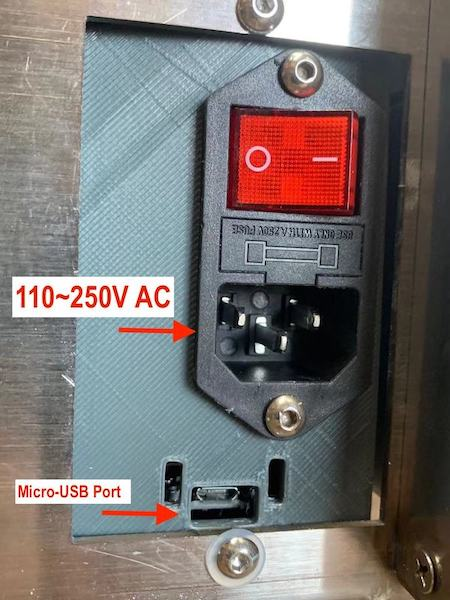
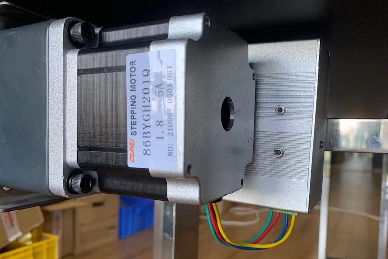
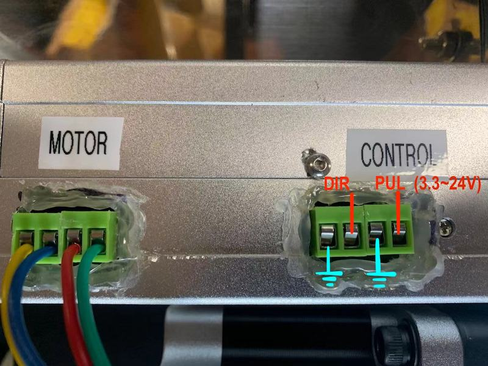

# 传送带使用说明(v0.1)

**Author**：Jerry Peng   &nbsp; &nbsp; &nbsp; **Date**：Sep. 27th, 2021
  
  

## 硬件部分
### 机械安装：开箱时，传送带本体与支架是拆分状态，请按如下图示，安装支架。

 

### 电气接口：下图所示为电源和USB通信接口。

 

### 电机连线及IO控制接口：
电机从下侧与控制器连接，线序如下图所示，发货时电机默认是连接状态。

 

控制器下侧接口如下图所示，电机连接到`MOTOR`接口上，另一个`CONTROL`接口是步进电机的IO控制接口，可以直接外接信号对电机进行直接控制，管脚定义如图示。

 

 

## 程控开发(Python API)
参见Python_API工程文件夹，其中包含一个`Conveyor.py` 文件，可直接被`conveyorCtrl.py`案例调用，几点使用指南如下：

* 设备使用CP2102 USB转UART芯片，在部分操作系统上（一般是较早版本的OS以及Windows)没有默认支持，需要自行下载并安装驱动，[下载链接](https://www.silabs.com/products/development-tools/software/usb-to-uart-bridge-vcp-drivers)；
* 安装pySerial库：需要确认开发环境安装了 Python 的 pyserial lib，以便使用串口给控制器发送指令。若没有安装请先安装【[参考链接](https://pypi.org/project/pyserial/)】，否则运行案例程序时会报错；
* 确认串口名称及权限：根据开发所使用的操作系统，参考案例代码提示，确认该控制器串口在本机上的串口名称，并确认已经开启了系统下用户对串口的访问权限（尤其是Linux系统，需要开启权限或以sudo运行），否者运行案例程序是会报错；
* 使用案例代码中的`setSpeed`函数，即可实现Python对设备的运动控制。

